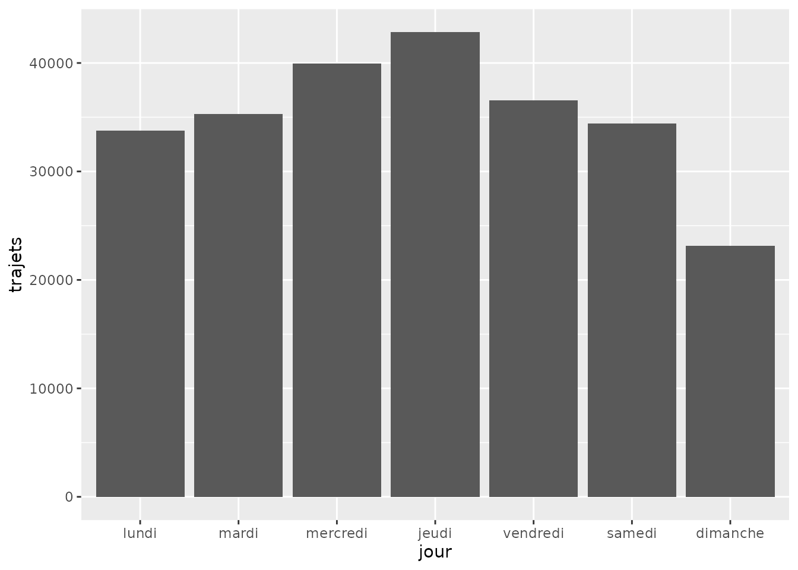

# Analyse des vélos

## Introduction

Ce guide présente l’utilisation du package `firstlib.lomane` pour
analyser les données de comptage de vélos à Nantes durant les vacances
de la Toussaint.

``` r
library(firstlib.lomane)
library(ggplot2)
data("df_velo")
```

## Étape 1 : Filtrer les données

Nous allons isoler les données pour les boucles de comptage 880 et 881.

``` r
# Utilisation de la fonction du package
donnees_nantes <- firstlib.lomane::filtrer_trajet(df_velo, boucle = c("880", "881"))

# Aperçu des données
head(donnees_nantes)
#> # A tibble: 6 × 32
#>   `Numéro de boucle` Jour        `00`  `01`  `02`  `03`  `04`  `05`  `06`  `07`
#>                <dbl> <date>     <dbl> <dbl> <dbl> <dbl> <dbl> <dbl> <dbl> <dbl>
#> 1                880 2025-11-02    30    27    14    11     5     3     4     4
#> 2                881 2025-11-02    14    23     3     1     3     1     9     9
#> 3                881 2025-11-01    28    19    17     6     3     5     5    14
#> 4                880 2025-11-01    45    29    19    13    11     5    10     4
#> 5                880 2025-10-31    30    13     8    12     7     7    22    66
#> 6                881 2025-10-31    18     7     3     3     2     5    21    57
#> # ℹ 22 more variables: `08` <dbl>, `09` <dbl>, `10` <dbl>, `11` <dbl>,
#> #   `12` <dbl>, `13` <dbl>, `14` <dbl>, `15` <dbl>, `16` <dbl>, `17` <dbl>,
#> #   `18` <dbl>, `19` <dbl>, `20` <dbl>, `21` <dbl>, `22` <dbl>, `23` <dbl>,
#> #   Total <dbl>, `Probabilité de présence d'anomalies` <chr>,
#> #   `Jour de la semaine` <dbl>, `Boucle de comptage` <chr>,
#> #   `Date formatée` <date>, Vacances <chr>
```

## Étape 2 : Visualisation avec ggplot2

Le package propose une fonction clé en main pour visualiser la
distribution hebdomadaire. Elle utilise `ggplot2` pour générer un
graphique clair des passages.

``` r
# Utilisation de la fonction intégrée
firstlib.lomane::plot_distribution_semaine(donnees_nantes)
```



## Conclusion

Vous savez maintenant comment charger, filtrer et visualiser les données
de mobilité nantaise avec `firstlib.lomane`.
